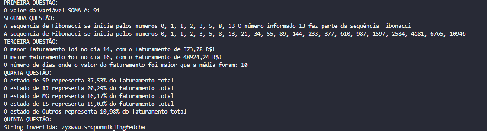

# Projeto de Questões TARGET!

Este projeto contém uma série de questões resolvidas em Java referentes a pergunta técnica da empresa Target Sistemas.

## Estrutura do Projeto

O projeto está estruturado em várias classes, cada uma resolvendo uma questão específica. As classes principais e suas funcionalidades são descritas abaixo:

## Aqui está um print da saída do console para todas as questões:

### 1. Primeira Questão

- **Classe**: `PrimeiraQuestao`
- **Descrição**: Observe o trecho de código abaixo: int INDICE = 13, SOMA = 0, K = 0; Enquanto K < INDICE faça { K = K + 1; SOMA = SOMA + K; } Imprimir(SOMA); Ao final do processamento, qual será o valor da variável SOMA?

### 2. Segunda Questão

- **Classe**: `SegundaQuestao`
- **Descrição**: Dado a sequência de Fibonacci, onde se inicia por 0 e 1 e o próximo valor sempre será a soma dos 2 valores anteriores (exemplo: 0, 1, 1, 2, 3, 5, 8, 13, 21, 34...), escreva um programa na linguagem que desejar onde, informado um número, ele calcule a sequência de Fibonacci e retorne uma mensagem avisando se o número informado pertence ou não a sequência.
- **Métodos**:
  - `verificarPresencaNaFibonacci()`: Verifica se um número faz parte da sequência de Fibonacci e imprime a posição.
  - `exibirSequenciaFibonacci()`: Exibe a sequência de Fibonacci até o limite fornecido.

### 3. Terceira Questão

- **Classe**: `TerceiraQuestao`
- **Descrição**: Dado um vetor que guarda o valor de faturamento diário de uma distribuidora, faça um programa, na linguagem que desejar, que calcule e retorne: O menor valor de faturamento ocorrido em um dia do mês; O maior valor de faturamento ocorrido em um dia do mês; Número de dias no mês em que o valor de faturamento diário foi superior à média mensal.
- **Métodos**:
  - `encontrarDiaComMenorFaturamento()`: Encontra o dia com o menor faturamento.
  - `encontrarDiaComMaiorFaturamento()`: Encontra o dia com o maior faturamento.
  - `contarDiasComFaturamentoAcimaDaMedia()`: Conta o número de dias com faturamento acima da média.

### 4. Quarta Questão

- **Classe**: `QuartaQuestao`
- **Descrição**: Dado o valor de faturamento mensal de uma distribuidora, detalhado por estado: SP – R$67.836,43; RJ – R$36.678,66; MG – R$29.229,88; ES – R$27.165,48; Outros – R$19 849,53. Escreva um programa na linguagem que desejar onde calcule o percentual de representação que cada estado teve dentro do valor total mensal da distribuidora.
- **Método**:
  - `calcularPercentualFaturamento()`: Calcula e imprime o percentual de faturamento para cada estado.

### 5. Quinta Questão

- **Classe**: `QuintaQuestao`
- **Descrição**: Escreva um programa que inverta os caracteres de um string.
- **Método**:
  - `inverterString()`: Inverte os caracteres de uma string e retorna a string invertida.

## Como Executar o Projeto

- Apenas execute, todos os métodos estão na classe Main.